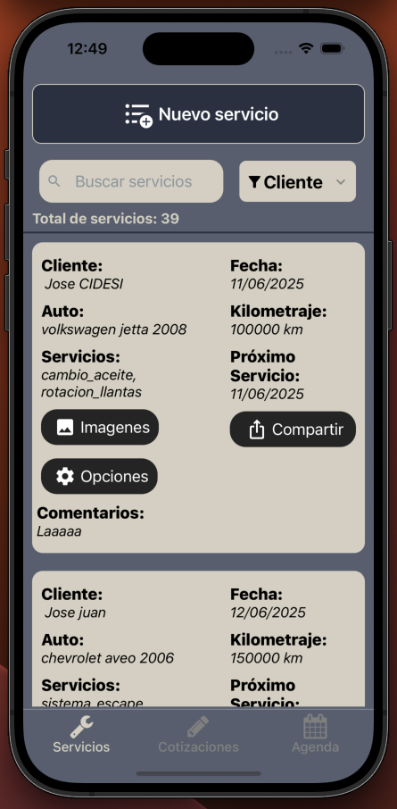
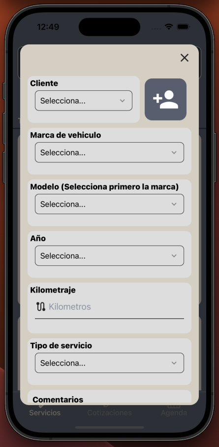
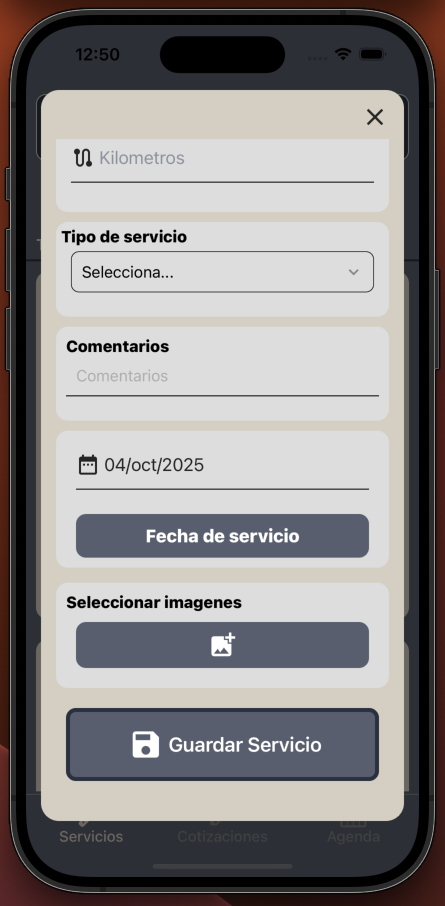

## Descripción

Aplicación móvil para teléfonos Android que provee herramientas para
administrar la información de tu taller automotriz.

## Funciones

- `Registro de servicios`: Almacena la información de los servicios que
  realizas en tu taller (Nombre de cliente, Fecha, Auto, Kilometraje, Servicios,
  Fecha de próximo servicio, Puntos de seguridad, Imágenes).

- `Visualizar servicios`: Consulta la información de los servicios que has
  registrado, puedes buscar por Cliente, Fecha o Auto. Te muestra las imágenes
  que guardaste

- `Genera un reporte`: Reporte en formato pdf con la información del servicio
  para compartir con tu cliente.

## Imágenes

## Reporte

<iframe src="https://drive.google.com/file/d/17HkU_oCXdL_XLHMRp4RhWc0Bf1RT6scR/preview" width="640" height="480" allow="autoplay"></iframe>

## Próximas mejoras

### Próximas Funciones

- `Sección para cotizaciones`: Similar la herramienta para registrar servicios
  pero para almacenar la información de cotizaciones, se ingresara los datos
  de costos de refacciones y de mano de obra.
- `Sección para agenda`: Herramienta para agendas servicios con fecha, hora,
  nombre de cliente, tipo de servicio. Para tener control y registro de los
  próximos servicios.
- `Aplicación para clientes`: Permite a los clientes ver el registro de los
  servicios de sus autos y recibir notificaciones para servicio de afinación.

### Mejoras

La aplicación requiere conexión a internet para funcionar ya que la información
de los servicios e imágenes se respaldan en la nube. Próximamente se actualizara
la estrategia de almacenamiento para que la aplicación pueda funcionar sin
conexión a internet.

## Sobre la aplicación y su futuro

El estado actual de la aplicación se logro con la retroalimentación de un taller
mecánico que actualmente la esta utilizando.

El objetivo del desarrollador es seguir implementado mejoras y nuevas
funcionalidades periódicamente con la retroalimentación de los usuarios.
