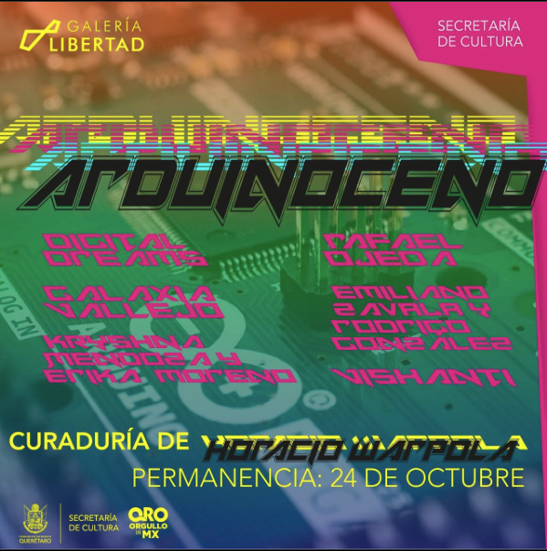
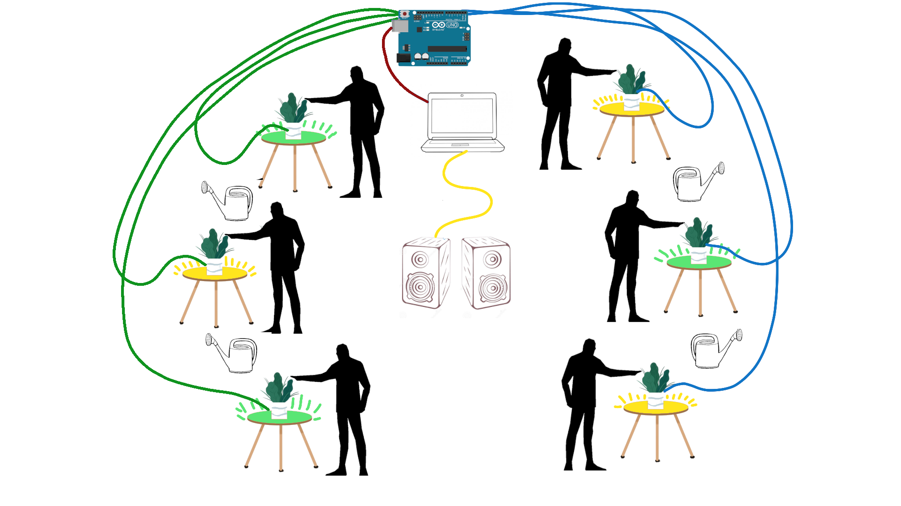
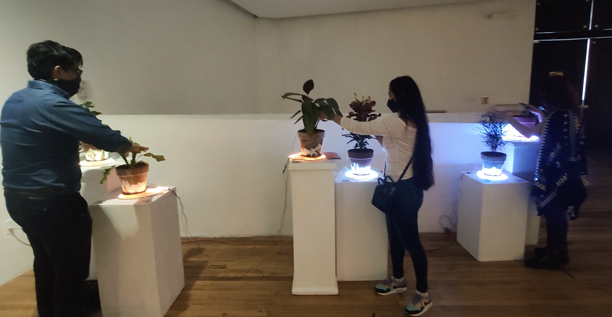
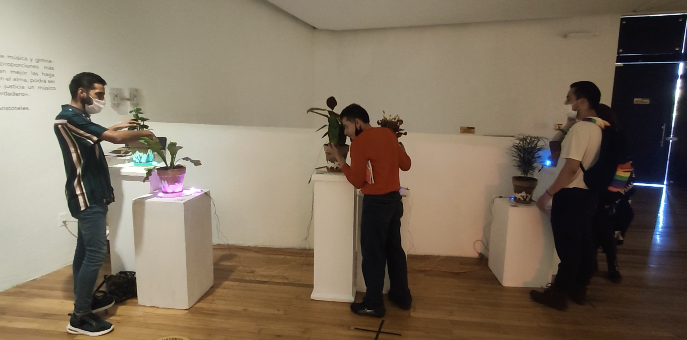
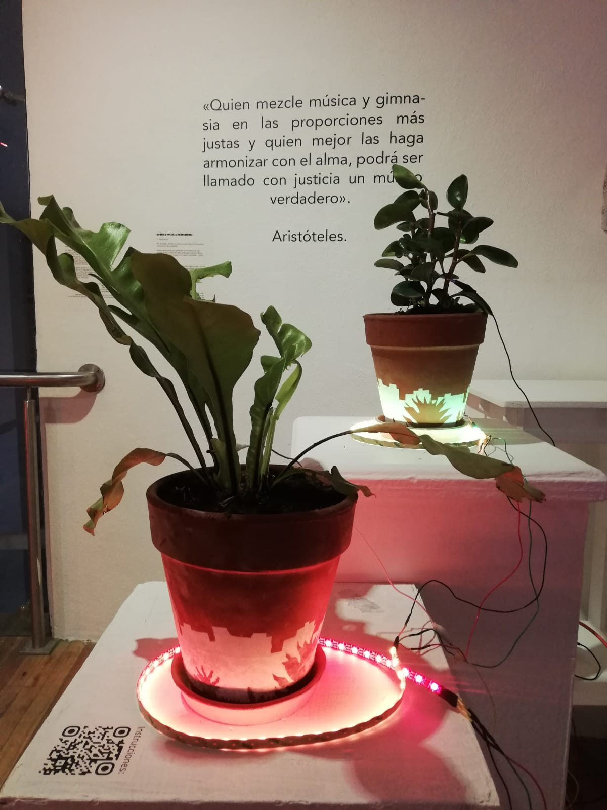
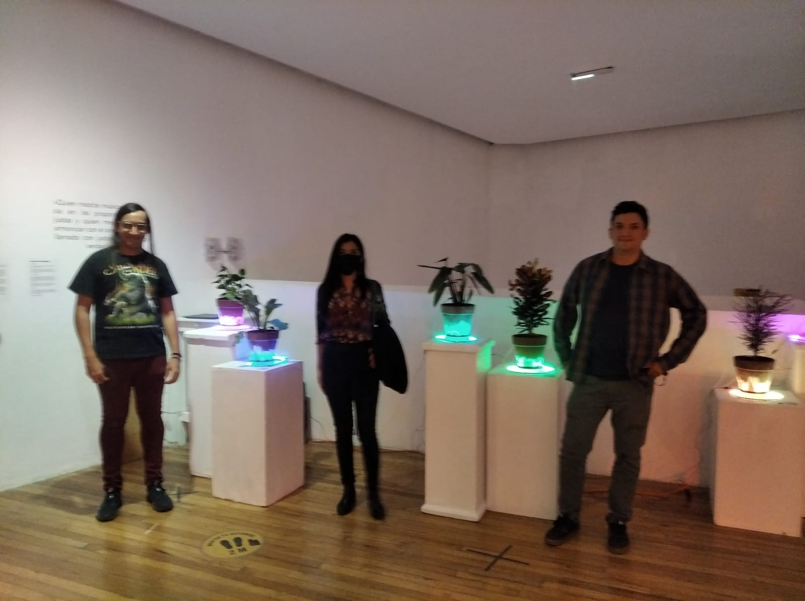
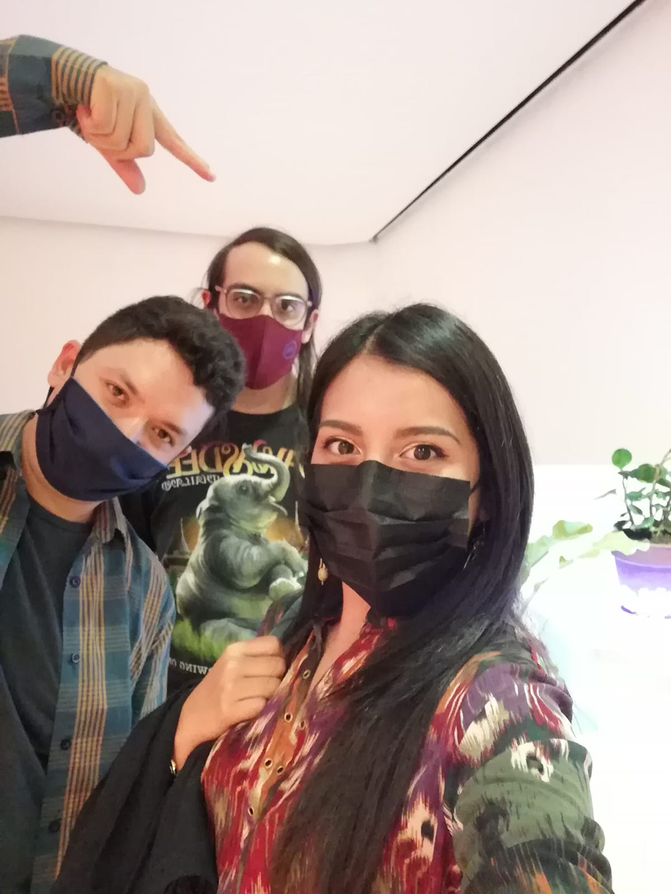

## Context

During 2021, in the state of Querétaro, Galería Libertad and Lata Transmedia
are launching an open call for submissions to a collective exhibition with
pieces that explore ideas about the so-called Anthropocene era, a geological
epoch proposed by a portion of the scientific community, characterized by the
significant global impact that human activities have had on terrestrial ecosystems.

  

## Project members

- Emiliano Zavala:
  - Idea Development
  - Concept
  - Audio Editing
  - Musical Composition
- Rodrigo Gonzalez:
  - Idea Development
  - Electronic Design
  - Programming
  
## Proposal

### Concept

Biofilia is a piece that seeks to connect its viewers with nature through visual
and audio stimuli.

### Piece Description

A cluster of strident city sounds is the first contact with the piece.
It is composed of six plants in groups of two that react to the stimulus of
human contact, causing the sounds of the city to be replaced by sounds of nature.

To replace the sounds of the city with sounds of nature in their entirety,
it is necessary to touch all the plants, but this requires the cooperation of
more people. Once everyone is in contact with the plants simultaneously, the
sound environment for that moment will be entirely of natural origin (animals,
birds, wind, rivers). Once this is achieved, the sounds fade away, giving way to
a song as a reward for connecting with nature.

### Assembly and Display

#### Assembly

Testing during assembly



#### Exhibition

### Relive the experience

Sounds of nature:

🐦  
🦉  
⛈️  
🦗  
🌊  

>Plays all the sounds of nature at once.

Sounds of the city:

🏘️🏭🚗

Song:

🎵

## Acknowledgments

On behalf of the Biofilia project, I would like to thank Galeria Libertad coordinator Paulina Macías and Lata Transmedia for providing the resources and space
for this piece.

On behalf of Rodrigo Gonzalez, I would like to thank Emiliano Zavala for being a crucial part
of this creative process and for all the effort and time invested
in the project.

The Biofilia project would like to thank Andrea de la Cruz for her collaboration in
selecting plants appropriate for the gallery environment and Naim Bolaños for
the graphic design of the pots used.

