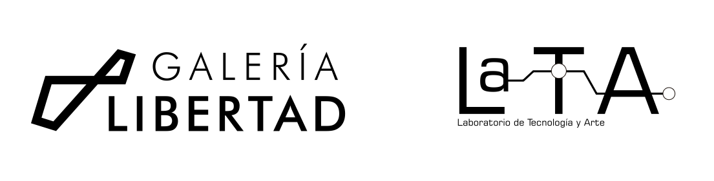
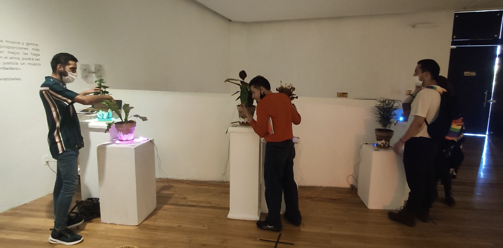

## Contexto

Durante el año 2021 en el estado de Querétaro la Galería Libertad y Lata Transmedia
lanzan una convocatoria abierta para presentar una exposición colectiva con
piezas que exploren ideas acerca de la llamada era del Antropoceno, época
geológica propuesta por una parte de la comunidad científica, la cual se
caracteriza por el significativo impacto global que las actividades humanas
han tenido sobre los ecosistemas terrestres.

  

## Integrantes del proyecto

- Emiliano Zavala:
  - Desarrollo de idea
  - Concepto
  - Edición de audio  
  - Composición musical
- Rodrigo Gonzalez:
  - Desarrollo de idea
  - Diseño electrónico
  - Programación
  
## Propuesta

### Concepto

Biofilia es una pieza que busca hacer conectar a sus espectadores con la
naturaleza mediante estímulos visuales y sonoros.

### Descripción de la pieza

Un cúmulo de sonidos estridentes de la ciudad es el primer contacto con la pieza.
Esta compuesta por 6 plantas en grupos de 2 que reaccionan al estimulo del contacto
humano provocando que los sonidos de la ciudad sean reemplazados por sonidos
de la naturaleza.  

Para reemplazar los sonidos de la ciudad por sonidos de la naturaleza en su totalidad
es necesario tocar todas las plantas pero para esto es necesaria la cooperación
de más personas, una vez que todas las personas, de manera simultanea, están en contacto
con las plantas el ambiente sonoro para ese momento sera totalmente de origen
natural (animales, aves, viento, ríos).

### Montaje y exposición

#### Montaje

Prueba durante montaje



#### Exposición

## Agradecimientos

De parte del proyecto Biofilia, gracias a la coordinador de Galeria Libertad
Paulina Macías y a Lata Transmedia por brindar los recursos y el espacio
para esta pieza.  

De parte de Rodrigo Gonzalez, gracias a Emiliano Zavala por ser parte crucial
de este proceso de creación y por todo el esfuerzo y tiempo invertido
en el proyecto.

El proyecto Biofilia agradece la colaboración de Andrea de la Cruz para la
selección de plantas adecuadas al entorno de la galería y a Naim Bolaños por
el diseño gráfico sobre las macetas utilizadas.

