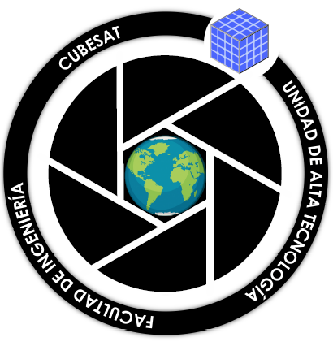
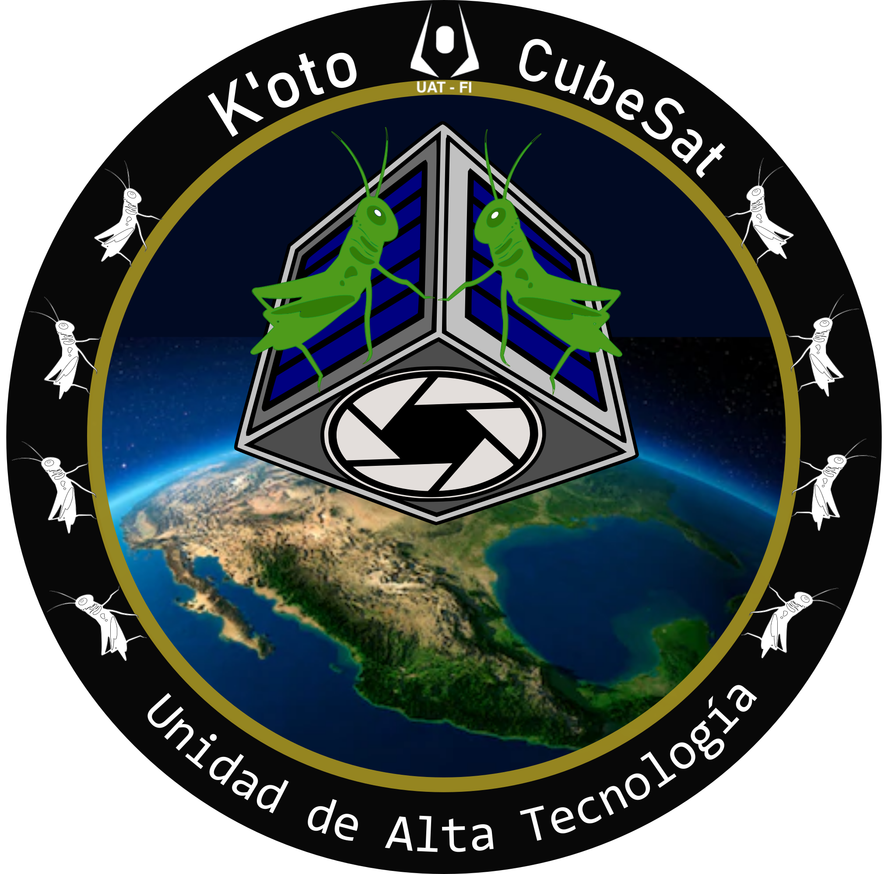
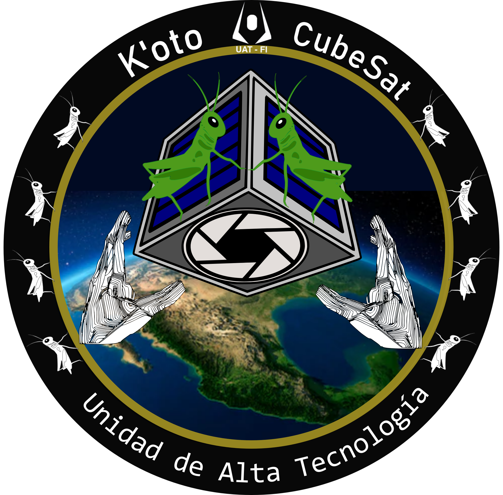
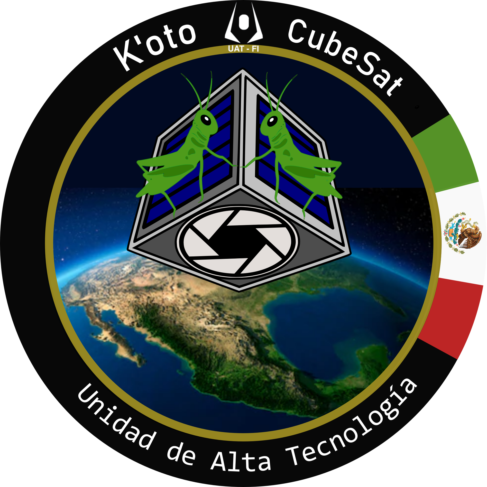

## Project Description

Project developed at the UAT (High Technology Unit) of the UNAM (National Autonomous University of Mexico) on the Juriquilla campus in the state of Querétaro. This project consists of the development of a CubeSat-type nanosatellite measuring 10 cm on each side.

The mission of the K'oto project is to capture images of Mexican territory.

The name K'oto comes from the Otomi language and means "grasshopper." The intention of naming the nanosatellite this way is to highlight the region and, at the same time, symbolize the leap Mexico is making toward the space industry.

## Contributions

The contributions mentioned here were made during my participation in the project for several months in 2018. The only thing I know of that is still in use is the logo I designed.

### Communication System

Research and documentation for the preliminary requirements review
for the communication system:

- Component selection
- Technical parameters

### Logo Design

Several logo proposals were developed, which are shown
below. It is worth noting that one of them was selected to be the
official project logo.

## Project Current Status

For more information on the project's current status, you can visit its Facebook page: [K'oto Facebook](https://www.facebook.com/Cubesat.Koto)
