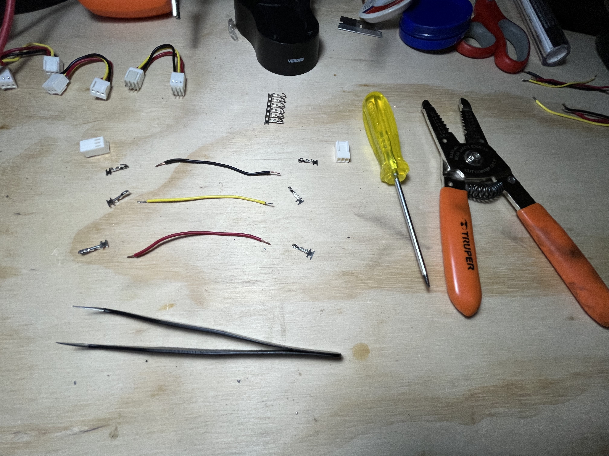
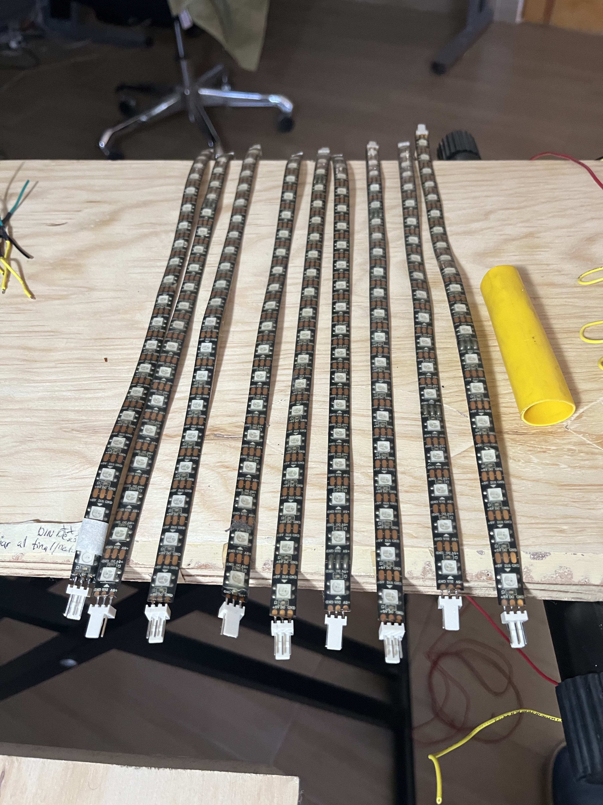
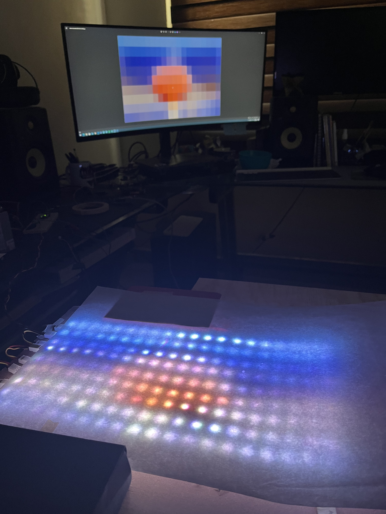
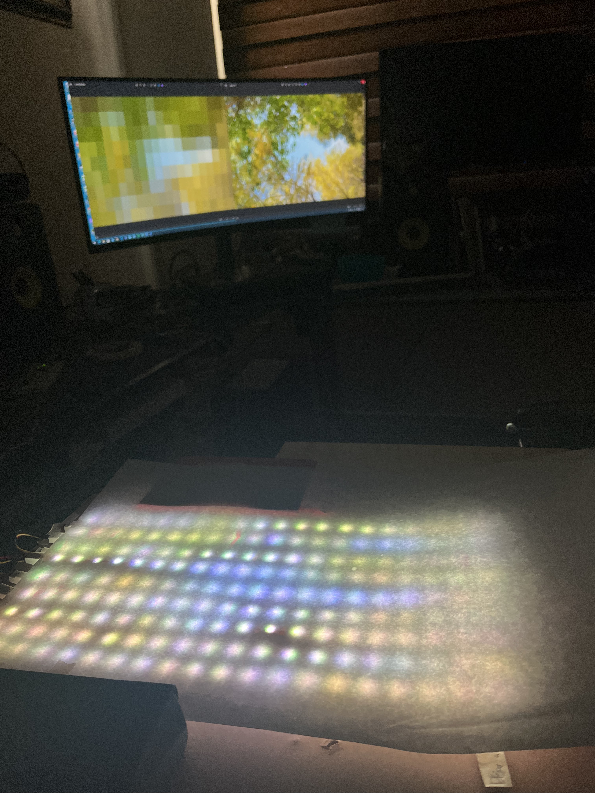
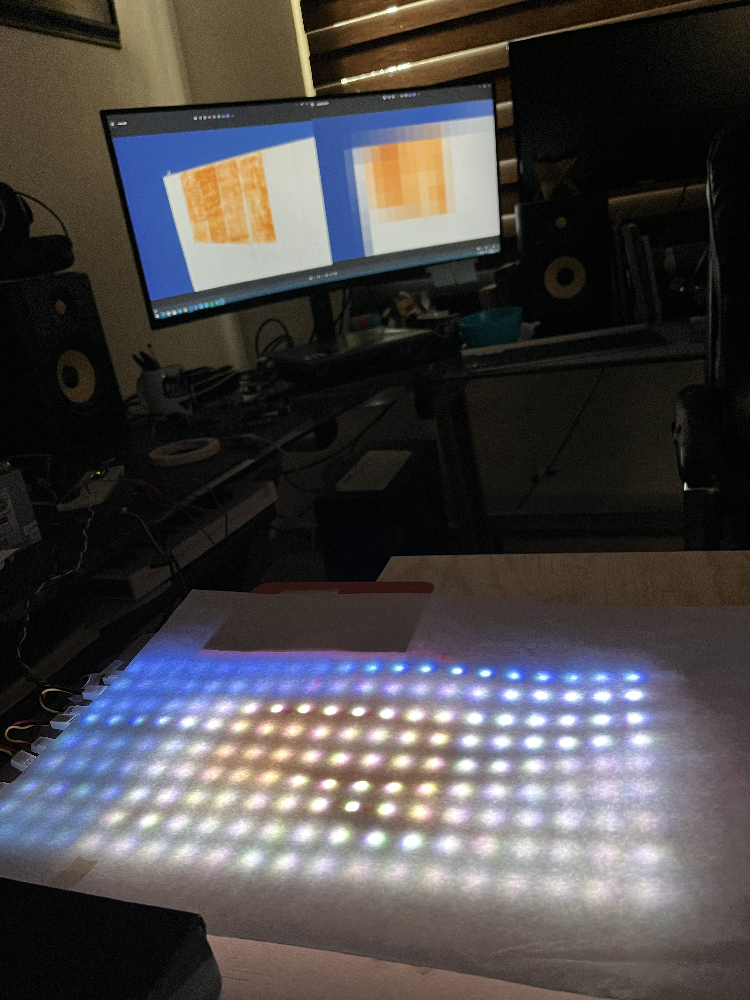

## Descripción

Matriz de LEDs con la capacidad de mostrar imágenes o video con
una resolución de 9x20 pixeles y una tasa de refresco de 90 fps.
Las imágenes/videos son procesados desde una computadora para
codificar los datos y enviarlos a un microcontrolador (stm32)
para generar la señal con los datos que serán consumidos por
las tiras LED.

El proyecto consta de 3 elementos principales:

- Tiras LEDs(ws2812b): conectadas en serie
- Microcontrolador(STM32 Nucleo-C031C6): Recibe los datos procesados por
  comunicación serial
- Computadora (Windows, OS, Linux): Ejecuta script que procesa las
  imágenes/videos y envía los datos por serial. Adicionalmente también es
  capaz de enviar animaciones generadas con el software Processing.

## Construcción

## Desarrollo

### 1er Prototipo

Usa el microcontrolador Arduino NANO.

Primeras pruebas procesando imágenes para adecuar a la resolución de la matriz
y obtener datos de cada pixel

Primera prueba enviando multiples imágenes, en el monitor se muestra la animación que generó
las imágenes. Las velocidades de reproducción entre la matriz LEDs y el monitor
no coinciden por las capacidades limitadas del microcontrolador.




### 2do Prototipo

Para este prototipo se uso el microcontrolador Nucleo-C031C6 de STM32,
lo cual mejoro significativamente el rendimiento ya que se hizo uso
de la función de DMA(Direct Memory Access) para la comunicación serial y
para la generación de PWM la cual se usa como señal de salida hacia las
tiras LED, así logrando una tasa de hasta 90 fps.

Los frames generados para los videos proyectados por la matriz de LEDs
son generados, procesados y enviados uno tras otro sin necesidad de
almacenar cada frame a diferencia del 1er prototipo que requería tener
todos los frames almacenados como imágenes.

Las animaciones son generadas con código desarrollado en Processing.

Animación interactiva en tiempo real , interacción con el cursor.


Animaciones



Video tomado de la cámara web y direccionado a la matriz de LEDs



Animación interactiva con entrada de audio desde guitarra

