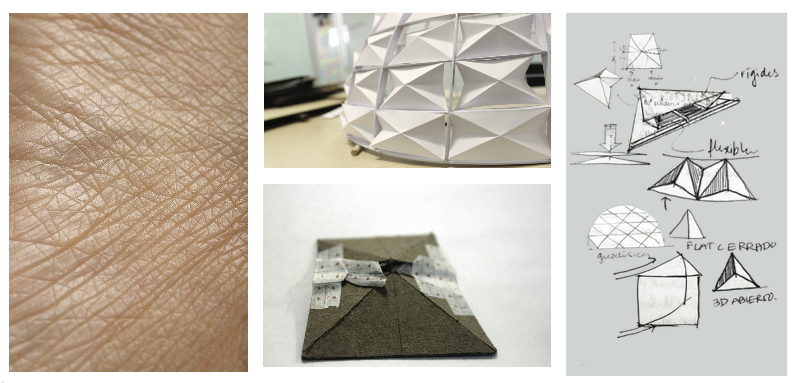
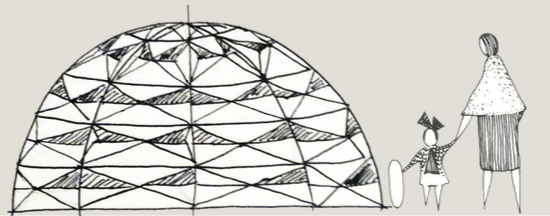

## Introducción

Un producto no sólo resuelve problemas y necesidades, es también el resultado
de un análisis social, económico y del entorno del ser humano que propicia una
comunicación entre el usuario y el objeto (producto). Para lograr esta
comunicación es importante que los diseñadores tengan en cuenta el mensaje que
se quiere enviar y la respuesta deseada del usuario; así mismo, se deben
conocer los principio de la semántica del producto que se van a utilizar.

La semántica del producto utiliza colores, formas, figuras y texturas para
mandar mensajes claros a través del producto [^1]. La semántica al ser
utilizada correctamente logra que el usuario se sienta emocional y
psicológicamente más cómodo, permitiendo establecer lazos emocionales con
objetos impersonales, en este caso, con el producto.

## Antecedentes

En la década de 1980 Uri Friedländer hacía hincapié en el cambio que tenía
la orientación del diseño, de ser analítica y racional a valores sensitivos y
emocionales [^2]. Uri Friedländer explicaba sus investigaciones a través del
uso de metáforas [^3].Metáfora natural, que presentan formas, movimientos o
acontecimientos naturales.

Expresa y remite a elementos o sucesos de la naturaleza, rescatando las formas y
planteando analogías. Por medio de analogías de la naturaleza
se pueden gestar nuevas conceptos e ideas, este
proceso analógico aporta estabilidad a los productos y permite un acercamiento
a las soluciones eficientes que existen en la naturaleza.

La biomimética observa, analiza y trata de imitar a
la naturaleza buscando soluciones a problemas
técnicos existentes.

La arquitectura y el diseño se presentan como
grandes áreas de oportunidad para la implementación de la biomimética.

Algunas aplicaciones son [^4] edificios o estructuras
capaces de interactuar con él entorno, tener formas
dinámicas, ser inteligentes, ahorrar energía, implementar nuevos materiales, etcétera.
[^4] Las estructura dinámicas son capaces de modificar su forma original a otra
a otras preestablecidas,
dependiendo de la interacción con su entorno y los
cambios del mismo.
Por medio de la biomimética se pueden analizar las
características de una fachada natural, la piel. La
piel tiene como principales funciones [^5]: proteger
organismos vivos dentro de ella del medio ambiente e interactuar con el mismo
monitoreando variables físicas como la temperatura y la humedad, haciendo
posible un control sobre ellas.

## Metodología

La solución propuesta fue crear un vínculo entre el
sistema y su dueño. Se citó en el capítulo anterior
que la semántica del producto es de suma importancia para que el usuario
desarrolle lazos con el
producto y que es posible crear estos lazos al imitar
funciones de la naturaleza. Se optó por utilizar los
conceptos de estructura dinámica y piles inteligentes
para mejorar distintos aspectos de los invernaderos
caseros.

El proyecto contaba con una estructura que servía
como base de un invernadero. Para lograr una
estructura dinámica se colocaron paneles alrededor
de la base, estos paneles posen una geometría
que les permite ser expandidos o contraídos.
Como actuador se tiene un motor que es capaz de
dar movimiento a los paneles y para controlar este
movimiento se utiliza un circuito detector de luminosidad,
que en base a la cantidad de luz recibida
decide si se contraen o expanden los paneles.

## Resultados parciales

Durante el transcurso del día el módulo expande o contrae sus paneles para
controlar la cantidad de luminosidad simulando un ser vivo. Este comportamiento
representa el concepto de pieles inteligentes y también involucra el uso de la
semántica del producto basado en el actuar de la naturaleza. Al imitar a la
naturaleza el usuario, a un nivel cognitivo, es consciente del invernadero y de
los cuidados que este requiere. Con base en este resultado y a la propuesta inicial
se pretende mejorar la comunicación (semántica del producto) en el uso de
invernaderos caseros.

## Referencias

[^1]: Demirbilek, O., & Sener, B. (2003). Product design, semantics and emotional response. Ergonomics, 46(13-14), 1346-1360.

[^2]: ZARAGOZÁ, W. R. (2011). Arte y diseño: desde su diferencia interpretativa hasta su denominador común en el arte conceptual, a la
luz de su enraizamiento en lo estético. Azafea: Revista de Filosofía, 12(1), 151-171.

[^3]: Castiblanco, M. R. (2010). El lenguaje comunicativo de los productos. Revista Grafías, (12), 13-16.

[^4]: Gruber, P. (2011). Biomimetics in architecture [Architekturbionik]. In Biomimetics--Materials, Structures and Processes (pp. 127-148).
Springer Berlin Heidelberg.

[^5]: Gruber, P., & Gosztonyi, S. (2010). Skin in architecture: towards bioinspired facades. WIT Transactions on Ecology and the Environ-
ment, 138, 503-513.
